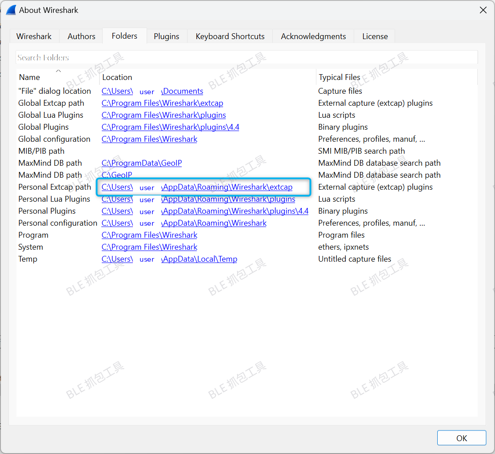
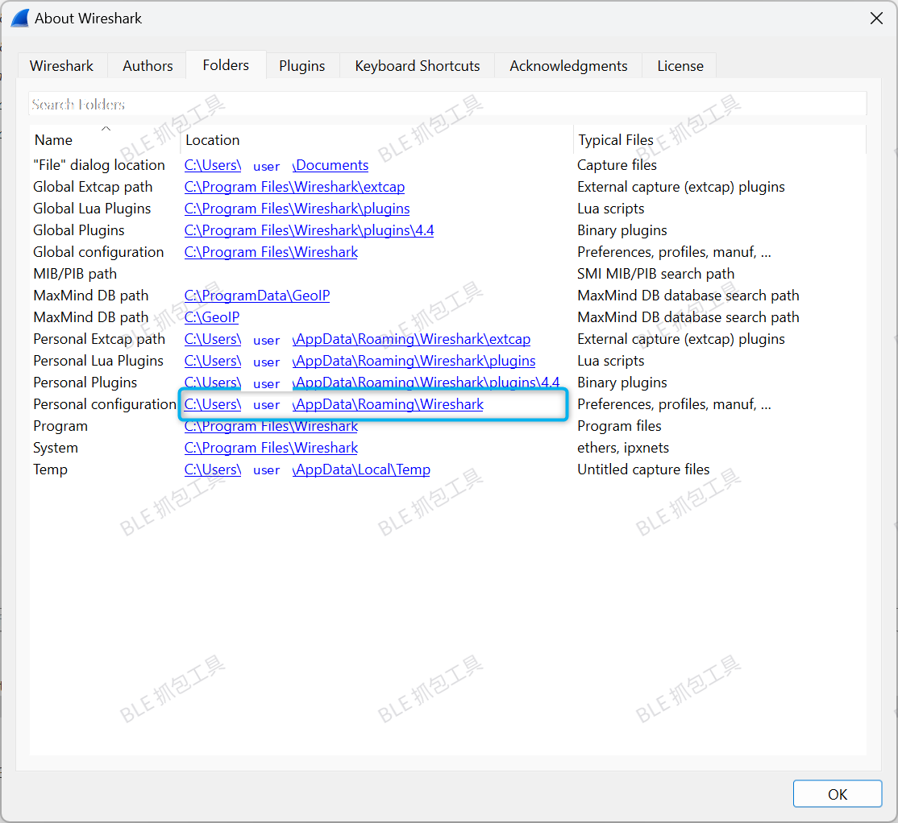

# BLE 抓包工具

使用 **Nordic nRF Sniffer for Bluetooth LE** 配合 **Wireshark** 搭建低功耗蓝牙(BLE)抓包环境。整体流程为:下载 Wireshark 与 nRF Sniffer 工具包 → 安装 Python 依赖 → 将 extcap 采集工具拷贝到 Wireshark 对应目录 → 在 Wireshark 中启用抓包功能 → 导入配置文件。

## 附件

- [nRF Sniffer 用户手册 (nRF_Sniffer_BLE_UG_v4.0.0.pdf)](assets/nRF_Sniffer_BLE_UG_v4.0.0.pdf)
- [nRF Sniffer 工具包 (nrf_sniffer_for_bluetooth_le_4.1.1.zip)](assets/nrf_sniffer_for_bluetooth_le_4.1.1.zip)

## 一、准备工作

### 1. 下载 Wireshark

下载地址:https://www.wireshark.org/download.html

### 2. 下载 nRF Sniffer 工具包

下载地址:https://www.nordicsemi.com/Products/Development-tools/nRF-Sniffer-for-Bluetooth-LE

> 本文档基于版本 `nrf_sniffer_for_bluetooth_le_4.1.1`,附件中已附带该工具包与官方用户手册。

## 二、安装与配置

### 1. 安装 Python 依赖

进入工具包的 `extcap` 目录,安装依赖:

```bash
cd nrf_sniffer_for_bluetooth_le_4.1.1/extcap
python3 -m pip install -r requirements.txt
```

### 2. 拷贝采集工具(extcap)

将 `nrf_sniffer_for_bluetooth_le_4.1.1/extcap` 目录下的**所有文件**拷贝到 Wireshark 的 extcap 目录。

目标目录可在 Wireshark 中通过 **Help → About Wireshark → Folders** 标签页查看(对应 Personal / Global Extcap path):



### 3. 验证工具是否正常

在 extcap 目录下运行以下命令,确认工具能正常识别接口:

```bash
nrf_sniffer_ble.bat --extcap-interfaces     ## Windows
./nrf_sniffer_ble.sh --extcap-interfaces      ## Linux / macOS
```

参考输出:

```text
extcap {version=4.1.1}{display=nRF Sniffer for Bluetooth LE}{help=https://www.nordicsemi.com/Software-and-Tools/Development-Tools/nRF-Sniffer-for-Bluetooth-LE}
control {number=0}{type=selector}{display=Device}{tooltip=Device list}
control {number=1}{type=selector}{display=Key}{tooltip=}
control {number=2}{type=string}{display=Value}{tooltip=6 digit passkey or 16 or 32 bytes encryption key in hexadecimal starting with '0x', big endian format.If the entered key is shorter than 16 or 32 bytes, it will be zero-padded in front'}{validation=\b^(([0-9]{6})|(0x[0-9a-fA-F]{1,64})|([0-9A-Fa-f]{2}[:-]){5}([0-9A-Fa-f]{2}) (public|random))$\b}
control {number=3}{type=string}{display=Adv Hop}{default=37,38,39}{tooltip=Advertising channel hop sequence. Change the order in which the sniffer switches advertising channels. Valid channels are 37, 38 and 39 separated by comma.}{validation=^\s*((37|38|39)\s*,\s*){0,2}(37|38|39){1}\s*$}{required=true}
control {number=7}{type=button}{display=Clear}{tooltop=Clear or remove device from Device list}
control {number=4}{type=button}{role=help}{display=Help}{tooltip=Access user guide (launches browser)}
control {number=5}{type=button}{role=restore}{display=Defaults}{tooltip=Resets the user interface and clears the log file}
control {number=6}{type=button}{role=logger}{display=Log}{tooltip=Log per interface}
value {control=0}{value= }{display=All advertising devices}{default=true}
value {control=0}{value=[00,00,00,00,00,00,0]}{display=Follow IRK}
value {control=1}{value=0}{display=Legacy Passkey}{default=true}
value {control=1}{value=1}{display=Legacy OOB data}
value {control=1}{value=2}{display=Legacy LTK}
value {control=1}{value=3}{display=SC LTK}
value {control=1}{value=4}{display=SC Private Key}
value {control=1}{value=5}{display=IRK}
value {control=1}{value=6}{display=Add LE address}
value {control=1}{value=7}{display=Follow LE address}
```

### 4. 在 Wireshark 中开启抓包功能

1. 刷新接口:**Capture → Refresh Interfaces**
2. 开启工具栏:**View → Interface Toolbars → nRF Sniffer for Bluetooth LE**

### 5. 拷贝配置文件(Profile)

将 `nrf_sniffer_for_bluetooth_le_4.1.1/Profile_nRF_Sniffer_Bluetooth_LE/` 文件夹拷贝到 Wireshark 对应目录(同样可在 **Help → About Wireshark → Folders** 中查看):


